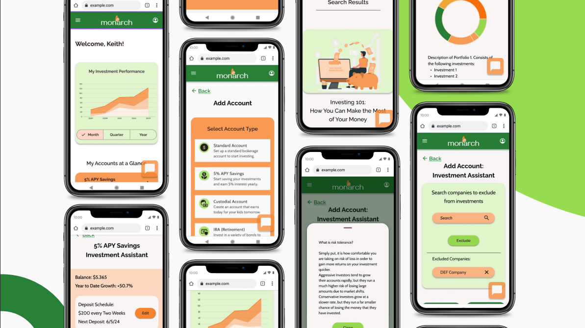

# Monarch

## Table of Contents
- [Introduction](#introduction)
- [Contributors](#contributors)
- [Features](#features)
- [Technologies Used](#technologies-used)
- [Installation](#installation)
- [Usage](#usage)
- [Contributing](#contributing)
- [Contact](#contact)

## Introduction
Welcome to the Investment App! This application provides users with a comprehensive platform to manage their personal and financial information, view investment details, and make informed financial decisions. The app is designed to be user-friendly, secure, and efficient, catering to both novice and experienced investors.

## Contributors

- [Ahmad Abusaif - Software Engineer](https://github.com/aabusaif8)
- [Francisco Alvarado - Software Engineer](https://github.com/falvarado7)
- [Matt Kulka - Software Engineer](https://github.com/MattKulka)
- [Rouzbeh Vahdatiasl - Software Engineer](https://github.com/Rouz275)

## Features
- **User Authentication:** Secure login and registration system.
- **Personal Information Management:** View and edit personal details.
- **Financial Information Management:** Access and update financial data.
- **Investment Dashboard:** Visualize and track investment performance.
- **Responsive Design:** Optimized for both desktop and mobile devices.

## Technologies Used
- **Frontend:** React, React Router, Tailwind CSS
- **Backend:** Node.js, Express
- **Database:** MongoDB
- **Authentication:** JWT (JSON Web Tokens)
- **API:** RESTful API

## Installation

- Clone the repository

- Run ```cd Hackathon--Team2-V2```
  
- Run ```npm install``` to install packages and dependencies
  
- Use ```npm run start``` from the root directory to run the frontend
  
- Run ```cd Boilerplate-Backend``` and ```npm install``` to install packages and dependencies
  
- Use ```npm run start:dev``` to run the backend

## Usage
Once the app is running, you can:
- Register a new account or log in with existing credentials.
- View and edit your personal and financial information.
- Explore your investment dashboard to monitor performance.

## Contributing
We welcome contributions to enhance the Investment App! To contribute, follow these steps:

1. **Fork the repository.**
2. **Create a new branch:**
    ```bash
    git checkout -b feature/your-feature-name
    ```
3. **Make your changes and commit them:**
    ```bash
    git commit -m 'Add some feature'
    ```
4. **Push to the branch:**
    ```bash
    git push origin feature/your-feature-name
    ```
5. **Create a pull request.**

Please ensure your code adheres to the project's coding standards and includes appropriate tests.

## Contact
If you have any questions or suggestions, feel free to contact us at aabusaif8@gmail.com.

Thank you for using the Investment App! We hope it helps you achieve your financial goals.

---


